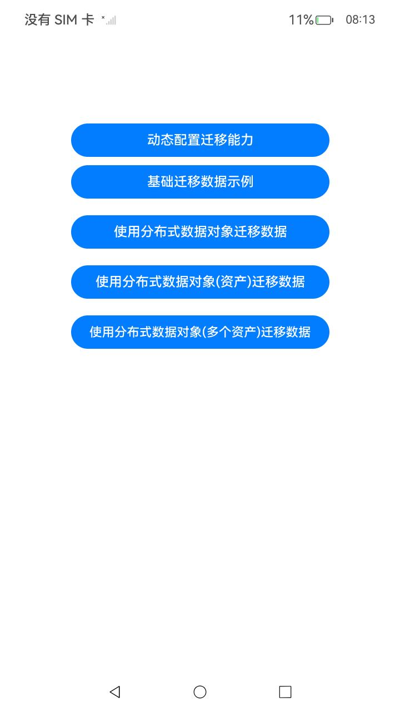

# 跨端迁移

### 介绍

本示例主要展示了应用数据跨端迁移的能力，通过跨端迁移的能力实现了一个简单的迁移应用，可以响应系统迁移事件，控制应用的迁移能力、是否迁移页面栈以及迁移后是否退出源端等。使用了分布式数据对象接口[@ohos.data.distributedDataObject](https://gitee.com/openharmony/docs/blob/master/zh-cn/application-dev/reference/apis-arkdata/js-apis-data-distributedobject.md)等接口，通过分布式数据对象以及资产实现了文件数据的流转迁移。本示例仅适配设备类型为phone。

### 效果预览

| 主页                             |
| -------------------------------- |
|  |

使用说明

1. 启动应用，进入主页，点击动态配置迁移能力按钮，可以跳转配置页设置迁移状态；
2. 进入主页，点击基础迁移数据示例，可以验证基础迁移数据；
3. 进入主页，点击使用分布式数据对象迁移数据，可以验证分布式对象基础数据迁移；
4. 进入主页，点击使用分布式数据对象资产迁移数据，可以验证分布式对象资产数据迁移；
5. 进入主页，点击使用分布式数据对象(多个资产)迁移数据，可以验证分布式对象多个资产数据迁移。

### 工程目录

```
entry/src/main/ets/
|---ability_devicea                        // 基础迁移数据示例对应ability
|---ability_devicea
|---common
|   |---Constant.ets                       // 常量
|   |---Logger.ets                         // 日志工具
|---continue
|   |---DataObj.ets                        // 分布式数据对象迁移数据界面
|   |---MultiAsset.ets                     // 分布式对象多个资产数据迁移界面
|   |---PageName.ets                       // 动态配置迁移能力界面
|   |---Second.ets                         // 基础迁移数据示例界面
|---entryability    
|---migrationability                       // 分布式数据对象迁移数据对应ability
|---migrationability_asset                 // 分布式数据对象资产迁移数据对应ability
|---migrationability_multi_asset           // 分布式数据对象多个迁移数据对应ability
|---migrationability_quickstart            // 快速启动目标应用对应ability           
|---pages
|   |---index.ets                          // 首页
```

### 具体实现

- 在示例应用里，迁移设置的功能在PageName.ets](entry/src/main/ets/continue/PageName.ets)中实现，通过[setMissionContinueState](https://gitee.com/openharmony/docs/blob/master/zh-cn/application-dev/reference/apis-ability-kit/js-apis-inner-application-uiAbilityContext.md#uiabilitycontextsetmissioncontinuestate10)可以设置当前应用任务流转的状态，控制当前应用是否具有迁移能力。
- 通过设置wantConstant.Params.SUPPORT_CONTINUE_PAGE_STACK_KEY和wantConstant.Params.SUPPORT_CONTINUE_SOURCE_EXIT_KEY的值可以控制当前应用是否迁移页面栈以及迁移后源端是否退出。源码参考：[EntryAbility.ets](entry/src/main/ets/entryability/EntryAbility.ets)。
- 通过分布式数据对象和分布式对象资产实现文件等数据的迁移。源码参考：[DataObj.ets](entry/src/main/ets/continue/DataObj.ets)，[MultiAsset.ets](entry/src/main/ets/continue/MultiAsset.ets)。

### 依赖

不涉及

### 约束与限制

1. 本示例仅支持标准系统上运行，支持设备：RK3568;
2. 本示例完整功能必须双端授予允许使用分布式协同能力,迁移等功能暂不支持RK3568。
3. 本示例为stage模型，已适配API version 12版本SDK，SDK版本号(API Version 12 Release),镜像版本号(5.0.0.16)。
4. 本示例需要使用DevEco Studio 版本号(5.0Release)及以上才可编译运行。
